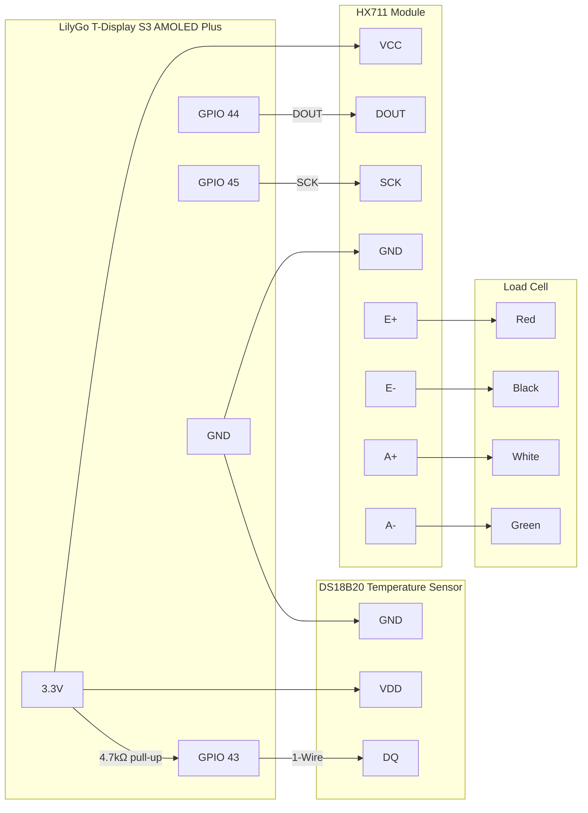

# BeeConnect32 — Sensor Connection Diagram

## Overview

```
┌─────────────────────────────────────────────────────────┐
│           LilyGo T-Display S3 AMOLED Plus               │
│                    (ESP32-S3)                           │
│                                                         │
│   3.3V ──────────────────────────────────────────────┐  │
│   GND  ──────────────────────────────────────────┐   │  │
│                                                  │   │  │
│   GPIO 43 (1-Wire) ───────────────────────────┐  │   │  │
│   GPIO 44 (DOUT)   ──────────────────────┐    │  │   │  │
│   GPIO 45 (SCK)    ─────────────────┐    │    │  │   │  │
└─────────────────────────────────────┼────┼────┼──┼───┼──┘
                                      │    │    │  │   │
                                      │    │    │  │   │
          ┌───────────────────────────┼────┼────┼──┘   │
          │        HX711 Module       │    │    │      │
          │                           │    │    │      │
          │  SCK  ────────────────────┘    │    │      │
          │  DOUT ─────────────────────────┘    │      │
          │  VCC  ──────────────────────────────┼──────┘
          │  GND  ──────────────────────────────┘
          │
          │  E+  ──── RED   ─────┐
          │  E-  ──── BLACK ──┐  │
          │  A+  ──── WHITE ──┼──┼───┐
          │  A-  ──── GREEN ──┼──┼───┼──┐
          └──────────────────┼──┼───┼──┼───
                             │  │   │  │
                    ┌────────┴──┴───┴──┴──────┐
                    │      Load Cell           │
                    │   (strain gauge, 4-wire) │
                    └──────────────────────────┘

          ┌───────────────────────────────────┐
          │        DS18B20                    │
          │                                   │
          │  VDD ─────────────────────────────┼── 3.3V
          │  GND ─────────────────────────────┼── GND
          │  DQ  ─────────────────────────────┼── GPIO 43
          └───────────────────────────────────┘
                            │
                        4.7 kΩ
                            │
                          3.3V   ← pull-up resistor required
```

---

## Pin Reference

| Signal | ESP32-S3 GPIO | Connected To |
|--------|--------------|--------------|
| 1-Wire Data | GPIO 43 | DS18B20 DQ |
| HX711 DOUT | GPIO 44 | HX711 DOUT |
| HX711 SCK | GPIO 45 | HX711 SCK |

---

## DS18B20 Temperature Sensor

| DS18B20 Pin | Connect To | Notes |
|-------------|-----------|-------|
| VDD (pin 3) | 3.3V | Power |
| GND (pin 1) | GND | Ground |
| DQ (pin 2) | GPIO 43 | Data — **requires 4.7 kΩ pull-up to 3.3V** |

> The 4.7 kΩ pull-up resistor is wired between the DQ line and 3.3V. Without it the 1-Wire bus will not function.

---

## HX711 Load Cell Amplifier

| HX711 Pin | Connect To | Notes |
|-----------|-----------|-------|
| VCC | 3.3V | Power |
| GND | GND | Ground |
| DOUT | GPIO 44 | Serial data out |
| SCK | GPIO 45 | Serial clock |
| E+ | Load cell RED | Excitation + |
| E- | Load cell BLACK | Excitation - |
| A+ | Load cell WHITE | Signal + |
| A- | Load cell GREEN | Signal - |

> Wire colours may vary by load cell manufacturer. Verify with your load cell datasheet.

---

## Load Cell Wiring

Standard 4-wire load cell colour convention:

| Wire Colour | HX711 Pin | Description |
|-------------|-----------|-------------|
| Red | E+ | Excitation positive |
| Black | E- | Excitation negative |
| White | A+ | Signal positive |
| Green | A- | Signal negative |

---

## Power Notes

- All sensors powered from the ESP32-S3 board's **3.3V** rail.
- The HX711 module may also accept 5V on VCC — check your specific module. Using 3.3V is safe and avoids level shifting on the data lines.
- The DS18B20 can operate in parasitic power mode (2-wire), but 3-wire (with dedicated VDD) is recommended for reliability.

---

## Schematic Summary (Mermaid)


